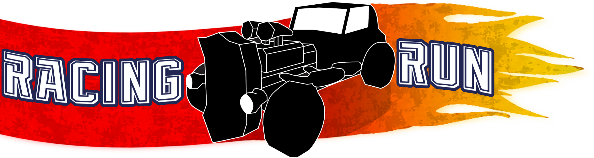

# RacingRun

RacingRun is a mobile infinit runner videogame in which the player will drive with a procedurally generated road dodging various obstacles to try to get as far as possible

This is a game developed by students from <a href="https://www.imagecampus.edu.ar/">Image Campus</a>

   

## Credits

- **Alejandro Barrero** - *Testing* -  
Mail: barrero_alejandro@hotmail.com
- **Octavio Uriel Elia** - *Art* - 
Mail: eliaoctavio@gmail.com
- **Ricardo  Jiménez** - *Audio* - 
Mail: ricardojc03@gmail.com
- **Leandro Sebastian Rodriguez** - *Programming* -  
Mail: leandro.s.rodriguez@outlook.com

This game was also possible thanks to the support of these professors:

- **Sergio Baretto**
- **Federico Barra**
- **Juan Pablo Bettini**
- **Jorge Cuéllar**
- **Fernando Puig**
- **Eugenio Taboada**

## Links

Download it from itch.io: https://leandrorodriguez98.itch.io/racing-run
